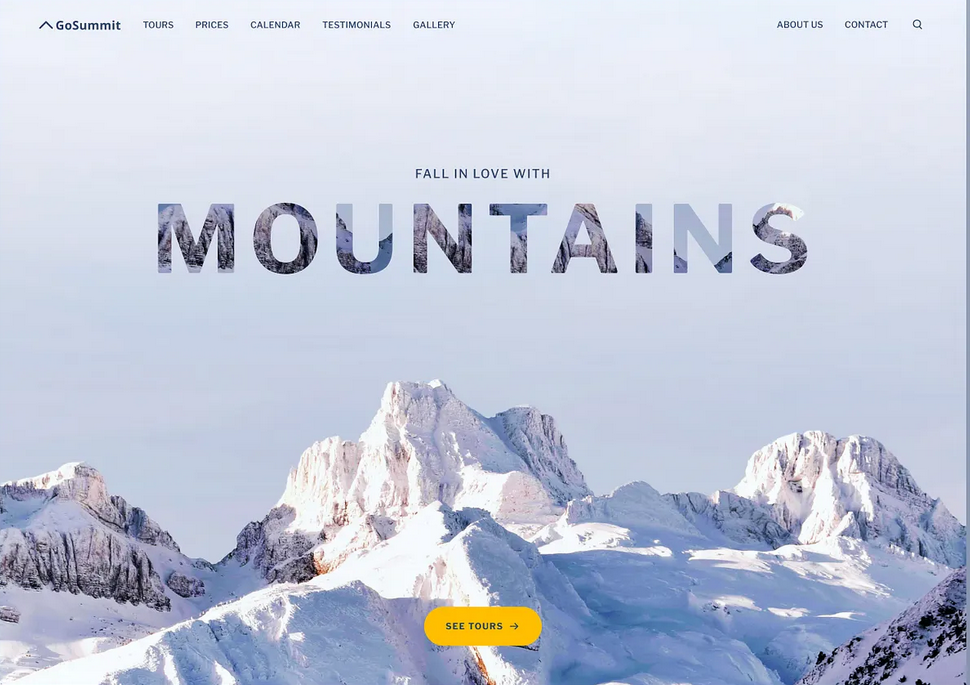

# GoSummit — Travel Landing Page



A modern, responsive travel landing page built with **React** and **Tailwind CSS**, inspired by the (https://dribbble.com/shots/16492435-Travel-website).

---

## Features

- **Full-screen hero** with a mountain backdrop and masked typography effect
- **Sticky transparent header** with smooth-scroll navigation and an expanding search bar
- **Tours, Pricing, Calendar, Testimonials, Gallery, About & Contact** sections
- Fully **responsive** — mobile hamburger menu included
- Clean, minimal aesthetic with a warm yellow accent color

## Tech Stack

- [React](https://react.dev/) — UI components
- [Vite](https://vite.dev/) — fast dev server & build tool
- [Tailwind CSS](https://tailwindcss.com/) — utility-first styling
- [Remix Icon](https://remixicon.com/) — icon set

## Getting Started

```bash
# Install dependencies
npm install

# Start development server
npm run dev

# Build for production
npm run build
```

## Design Credit

UI design by (https://dribbble.com/shots/16492435-Travel-website).
